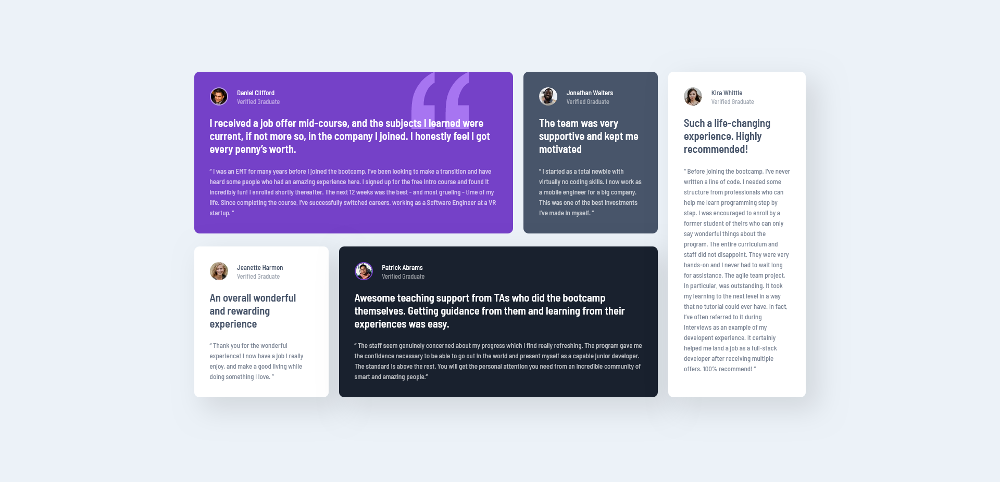

# Frontend Mentor - Testimonials grid section solution

This is a solution to the [Testimonials grid section challenge on Frontend Mentor](https://www.frontendmentor.io/challenges/testimonials-grid-section-Nnw6J7Un7). Frontend Mentor challenges help you improve your coding skills by building realistic projects. 

## Table of contents

- [Overview](#overview)
  - [The challenge](#the-challenge)
  - [Screenshot](#screenshot)
  - [Links](#links)
- [My process](#my-process)
  - [Built with](#built-with)
  - [What I learned](#what-i-learned)
  - [Continued development](#continued-development)
  - [Useful resources](#useful-resources)
- [Author](#author)
- [Acknowledgments](#acknowledgments)

## Overview

### The challenge

Users should be able to:

- View the optimal layout for the site depending on their device's screen size

### Screenshot



### Links

- Solution URL: [Available on github pages](https://your-solution-url.com)

## My process

### Built with

- Semantic HTML5 markup
- CSS
- JavaScript

**Note: I am still very much a beginner so my knowledge is quite limited**

### What I learned

I struggled a bit at the start with the layout of all the testimonials, but was able to tackle it by using multiple flexbox containers. 

```css
    #testimonial-container {
        max-width: 1175px;
        margin: auto;
        padding: 0px;
    }

    #testimonial-5 {
        flex-basis: 22.5%; /*the use of the flex basis property made the page more responsive*/
    }

    #left-container { /* all testimonials other than the rightmost one */
        flex-direction: column;
        flex-basis: 77.5%;
    }

    #left-container .testimonial { 
        margin-right: 20px;
    }

    #top,
    #bottom {
        flex-basis: 50%;
    }

    #testimonial-1,
    #testimonial-4 {
        flex-basis: 70.5%;
    }
    
    #testimonial-2,
    #testimonial-3 {
        flex-basis: 29.5%;
    }
```
I managed to tackle the rightmost container by separating it from the others - allowing it to stretch to fit the remaining space. This is shown in the code above and in my html. I then split the `#left-container` into `#top` and `#bottom` so that I could use the `flex-basis` property on the individual sections to divide the boxes proportionally. 

### Continued development

I would like to deepen my knowledge on flexbox and definitely improve how I centre the parent divider (in this case it's the `#testimonial-container`).

### Useful resources

- [W3schools](https://www.w3schools.com/css/) - Helped me with styling certain elements
- [MDN web docs](https://developer.mozilla.org/en-US/) - Perfect for reference and looking at CSS attributes in detail

## Author

- Frontend Mentor - [@SushiOnToast](https://www.frontendmentor.io/profile/SushiOnToast)
- CodePen - [@SushiOnToast](https://codepen.io/SushiOnToast)
- CodeWars - [@SushiOnToast](https://www.codewars.com/users/SushiOnToast)

## Acknowledgments

I stumbled upon this challenge while following a tutorial by Zach Gollwitzer on YouTube - so big thanks to him for teaching me so much!
